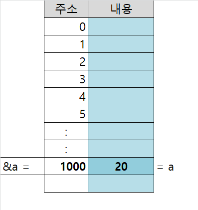

# 포인터

## *의 용법
**변수 이름에 붙었을 때***


S* - > S를 건드리고싶어서 받음.


### ★ int* 역시 데이터이다!

메모리 번지수의 범위는 4byte 크기까지 나올 수 있다(0~42억 9천만)

이것은 unsinged int 와 같고 16진수(0~g까지)로 저장한다. // 0x123444 ... 


### PP (포인터의 포인터)

**이중 포인터는 포인터의 값을 바꾸기 위해 쓰인다.**

ex) S** -> S*에 접근하고 싶어서 사용한다.

```cpp
ADDRINFOA* result{};

// 인수 설명: const char* == PCSTR /node 각각 연결되어있는 하나의 객체 /servicename == 특정 포트 네임 
//pp == 포인터 포인터 - 동적 할당을 한다는 의미이다. 
//이 함수를 거치면서 result 값이 변화한다.
getaddrinfo(buf, nullptr, &hint, &result);

// 함수가 끝나더라도 참조형으로 넘겨준 ADDRINFOA* result 값은 남아있기 때문에 result값을 지워주는 함수를 호출한다.
freeaddrinfo(result);
```


```cpp
//포인터에 접근하고 싶을 때는 포인터의 포인터 **(pp)를 사용한다.
void deletePP(int** pp)
{
	messPPP(&pp);

	//delete *pp;
	//*pp = nullptr;
}
```


## &(참조)의 용법

***참조란? == 주소를 얻어오는 행위***

***변수의 주소를 나타내고 싶을때 변수 앞에 &붙인다. ( == 참조)***

변수의 주소 == & 변수 이름 (변수 이름의 참조)
배열의 주소 == 배열의 이름
벡터의 주소 == std::vector<int> a; a == vector a의 이름
함수의 주소 == 함수의 이름 () 없이

```cpp
#include <iostream>
#include <vector>
//변수의 주소
int a{};

//pa는 변수 a의 주소값을 갖는다.
int* pa{ &a };

std::vector<int> v_a{};


```


&a -> (메모리 상에서의) a의 시작 주소(혹은 a의 시작 번지)

**참조는 바꿀 수 없다.!**

```cpp
	bool success{ true }; 
	//const bool* const b{ &success }; //오류! 
	const bool* b{ &success }; //오류가 아님, - bool b의 값을 바꾸지 않겠다는 것임.

	b = nullptr;
```


```cpp
	//의미 없는 코드, 참조를 바꿀 수 없다.
	const sockaddr_in& const jca = m_q_joining_client_addrs.front();
```


***자료'형'에 &를 붙인다는 것은 참조'형'을 의미한다. ( == 참조형)***

```cpp
#include <string>

string s{ "hello" };
	//c는 string s 각각의 항목을 의미한다.
for (char& c : s)
{
	// \n 문자 생략
	cout << c;
}
```





```cpp
// p = 1000;
int a = 20;
int* pa = &a; //역참조
//pa == 20


int a = 10;
int& ra = a;
//ra == 10;
```

<strong>int*는 자료형 p는 변수명 &a 는 상수가 된다.</strong>


```cpp
// int a = 20;
// int* p = &a; 에 대한 해설

// a = 20

// &a = 100번지(가정)

// p = 100번지

// &p = 300번지

// *p = 20 (p가 100번인데 p가 가르키고 있는 값이 뭐냐? == p가 참조하는 값)
```


### ★☆참조형 변수와 포인터 변수의 차이점

```cpp

	int a{};

//원본 a를 바꾸는 방법 (포인터 사용) (역참조)
{
	int* pa{ &a };
	*pa = 10;
}
//원본 a를 바꾸는 방법 (참조형 사용)
{
	int& ra{ a };
	ra = 10;
}

#include <iostream>

int main() 
{
	int a{};

	//원본 a를 바꾸는 방법(포인터 사용)
	int* pa = &a; // 역참조
	*pa = 20; 

	printf(" %d",a); //result 20

	//원본 a를 바꾸는 방법(참조형 사용)
	int& ra = a; 
	ra = 30;

	printf("\n %d", a); //result 30

	return 0;
}
```


```cpp
#include <vector>
#include <algorithm>
#include <iostream>

void vectorSort(std::vector<int>* input)
{
	sort(input->begin(), input->end());
}

// void vectorSort(std::vector<int>& input)
// {
// 	sort(input.begin(), input.end());
// }


int main()
{
	std::vector<int> v_input{ 5, 7, 6 };

	vectorSort(&v_input);

	for (int i = 0; i < v_input.size(); ++i)
	{
		printf(" %d ", v_input[i]);
	}

	return 0;
}

// int main()
// {
// 	std::vector<int> v_input{ 5, 7, 6 };

// 	vectorSort(v_input);

// 	for (int i = 0; i < v_input.size(); ++i)
// 	{
// 		printf(" %d ", v_input[i]);
// 	}


// 	return 0;
// }

```


## 동적 할당 해제(delete)의 구현

```cpp
int main() {
	//물리적으로 null을 가리키는 da가 생긴다. 
	int* da{};

	//HEAP에 5를 가리키는 공간이 새로 생기고 da
	da = new int{ 5 };

	//heap 영역에 있는 동적 할당된 메모리가 7이 된다. 
	*da = 7;

	int* da_copy = da;

	//delete는 heap 영역에 있는 동적 할당된 메모리에 접근을 막는다.
	//delete da;
	//da_copy가 가르키는 heap 영역의 값은 접근이 불가능해지고, da는 댕글링포인터가 된다.
	delete da_copy;

	return 0;
}
```

```cpp
//==deletePP();

//포인터의 참조형을 사용한다면, 원본과 포인터 둘다 바꿀 수 있다.
void deleteRef(int*& ref)
{
	delete ref;
	ref = nullptr;
}

void deleteP(int* p)
{
	delete p;
}

//포인터에 접근하고 싶을 때는 포인터의 포인터 **(pp)를 사용한다.
void deletePP(int** pp)
{
	messPPP(&pp);

	//delete *pp;
	//*pp = nullptr;
}

void messPPP(int***ppp)
{
	*ppp = nullptr;
}

void cannotMessPPP(int** const* ppp)
{
	//컴파일 오류
	//*ppp = nullptr
}


int main() {
	//(메모리상에서) 물리적으로 null을 가리키는 da가 생긴다. 
	int* da{};

	// heap 영역에서 5를 가리키는 공간이 새로 생기고 da
	da = new int{ 5 };

	// heap 영역에 있는 동적 할당된 메모리가 7이 된다. 
	*da = 7;

	{
		//int* da_copy = da;
		
		//delete는 heap 영역에 있는 동적 할당된 메모리에 접근을 막는다.
		//delete da;
		
		//da_copy가 가르키는 heap 영역의 값은 접근이 불가능해지고, da는 댕글링포인터가 된다.
		//delete da_copy;
	}

	{
		//함수의 인수는 복사된 값이 들어감으로 da는 댕글링포인터가 된다.
		
		//deleteP(da);
		//deletePP(&da);

		//delete da;
	}

	//(우리가 체감상) 원본에 접근 할 수 있다...!
	deleteRef(da);
	
	return 0;
}
```

[]


```cpp

#include <iostream>
#include <vector>
#include <algorithm>

struct s_test
{
	int a;
	int b;
	int c;

};

//s_test* 라는 구조체를 참조형으로 받는다.
void test_sort(s_test*& my_struct)
{
	// s_test의 맴버 변수들을 백터로 만들어보자.
	std::vector<int> v_index{ my_struct->a, my_struct->b, my_struct->c };

	sort(v_index.begin(), v_index.end());

	my_struct->a = v_index[0];
	my_struct->b = v_index[1];
	my_struct->c = v_index[2];
}

int main()
{
	std::vector<s_test*> v_test{};

	v_test.push_back(new s_test{ 5, 2, 1 });
	
	std::cout << v_test[0]->a << ' ';
	std::cout << v_test[0]->b << ' ';
	std::cout << v_test[0]->c << ' ';

	test_sort(*&v_test[0]);

	printf("\n \n after sort: \n \n");

	std::cout << v_test[0]->a << ' ';
	std::cout << v_test[0]->b << ' ';
	std::cout << v_test[0]->c << ' ';
	
	delete v_test[0];

	return 0;
}

```
