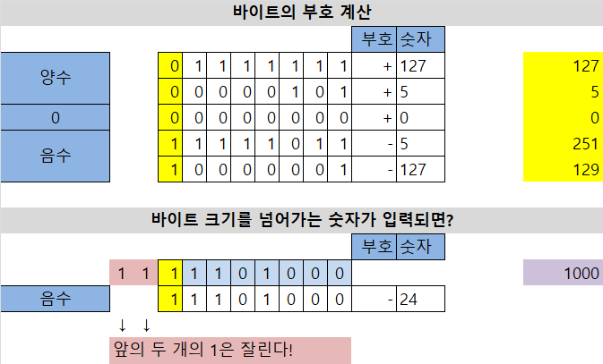

# JAVA

## 용어

클래스(class)

- 메서드(method)
- 인스턴스(instance) = 객체(object)

변수(variable), 상수(constant)

리터럴(literal)

```java
int a = 10; // 10은 리터럴, a는 변수 이름
String b = "hi"; // "hi"는 리터럴, b는 String이라는 클래스의 인스턴스(instance)
float c = 3.14f;
```


## 자료형

### 기본 자료형 Primitive data type

#### 모든 자료형은 부호가 있는 자료형

```java
byte, short, int, long // 1, 2, 4, 8 바이트
float, double // 4, 8 바이트
char // 2 바이트
boolean // 1 비트
```


### 형변환

#### 묵시적 형변환

```java
// long이 아닌 정수 자료형은 + - * / 어떤 계산을 하든 전부 int로 묵시적 형변환
byte ba = 1;
byte bb = 2;
int bc = ba - bb; // byte + byte = int (묵시적 형변환)

short sa = 1;
short sb = 0;
int sc = sa + sb; // short + short = int (묵시적 형변환)

int ia = 1;
int ib = 2;
int ic = ia + ib;


// long일 때만 long으로 묵시적 형변환
long la = 1;
long lb = 2;
long lc = la + lb; // long + @ = long (묵시적 형변환)
```


#### 명시적 형변환

```java
short a = 1;
short b = 2;
short d = (short)(a + b); // a + b를 short라고 명시함
```

```java
float a = 1 / 10; // a는 0이 된다! (1이 int형이기 때문)
float b = 1.0f / 10;
float c = (float)1 / 10; // b는 0.1f이 된다
```





## 반복문

#### for문

```java
for (int i = 0; i < 500; ++i)
{
    if (i == 3) {
        continue; // 건너뛰기
    }

    System.out.println(i);
    
    if (i == 10)
    {
        break; // 탈출하기
    }
}
```

```java
here:
        for (int i = 0; i < 5; ++i)
        {
            for (int j = 0; j < 10; ++j)
            {
                System.out.println("i = " + i + " j = " + j);

                if (i == 3 && j == 2) {
                    break here;
                }
            }
        }


```

```java
//result 
*****
****
***
**
*

for (int y = 0; y < 5; ++y)
{
    for (int x = 0; x < 5 - y; ++x)
    {
        System.out.print("*"); 
    }

    System.out.print("\n");
}
```


```java
//result
*
**
***
**
*

for(int y = 0; y < 5; ++y)
{
    int count = y + 1;

    if (count > 3)
    {
        count = 5 - y; 
    }

    for (int x = 0; x < count; ++x)
    {
        System.out.print("*");
    }

    System.out.print("\n");
}
```

```java
//result
    *
   **
  ***
 ****
*****

for(int y = 0; y < 5; ++y)
{
    for(int x = 0; x < 4 - y; ++x)
    {
        System.out.print(" ");
    }

    for(int x = 0; x < y + 1; ++x)
    {
        System.out.print("*");
    }

    System.out.print("\n");
}
```

```java
//result
**** ****
***   ***
**     **
*       *

for(int y = 0; y < 9; ++y)
{
    for(int x = 0; x < 4 - y; ++x)
    {
        System.out.print("*");
    }
    for(int x = 0; x < y + 1; ++x)
    {
        System.out.print(" ");
    }
    for(int x = 0; x < y; ++x)
    {
        System.out.print(" ");
    }
    for(int x = 0; x < 4 - y; ++x)
    {
        System.out.print("*");
    }

    System.out.print("\n");
}
```

```java
//result
**** ****
***   ***
**     **
*       *

for(int y = 0; y < 9; ++y)
{
    for(int x = 0; x < 4 - y; ++x)
    {
        System.out.print("*");
    }
    for(int x = 0; x < y * 2 + 1; ++x)
    {
        System.out.print(" ");
    }
    for(int x = 0; x < 4 - y; ++x)
    {
        System.out.print("*");
    }

    System.out.print("\n");
}
```

```java
//result
*    *    *
*   * *   *
*  *   *  *
* *     * *
**       **

for(int y = 0; y < 5; ++y)
{
    System.out.print("*");

    for(int x = 0; x < 4 -y; ++x)
    {
        System.out.print(" ");
    }
    if(y != 0)
    {
        System.out.print("*");
    }

    for(int x = 0; x < y - 1; ++x)
    {
        System.out.print(" ");
    }

    for(int x = 0; x < y; ++x)
    {
        System.out.print(" ");
    }

    System.out.print("*");

    for(int x = 0; x < 4 - y; ++x)
    {
        System.out.print(" ");
    }

    System.out.print("*");

    System.out.print("\n");
}
```


## 배열

### 선언과 초기화

#### 선언과 기본 초기화

```java
int[] arr = new int[5]; // arr의 모든 항목은 0으로 초기화된다!★
```

#### 초기화 - 초기화 리스트

```java
int[] arr = {1, 3, 5, 7};

for(int i = 0; i < arr.length; ++i)
{
    System.out.println(arr[i]);
}
```

#### 값 대입 - 일일이 대입

```java
int[] arr = new int[2];
arr[0] = 1;
arr[1] = 2;

for(int i = 0; i < arr.length; ++i)
{
    System.out.println(arr[i]);
}
```

#### 값 대입 - Arrays.fill() (c++의 memset)

```java
int[] arr = new int[5];
Arrays.fill(arr, -1);
```


### 배열의 크기

#### final 멤버 변수★인 length 활용하기 (메소드가 아니다!)

```java
int[] arr = {1, 3, 5, 7};
System.out.print("배열의 크기는 " + arr.length);
```


### 배열의 복사

#### Arrays.copyOf()를 이용한 값 복사 (c++의 memcpy)

```java
int[] arr0 = new int[5];
int[] arr1 = new int[5];
Arrays.fill(arr0, 3);
Arrays.fill(arr1, -1);

arr1 = Arrays.copyOf(arr0, arr0.length);
```

#### Arrays.copyOf()를 이용한 객체 복사

```java
int[] arr0 = { 1, 2, 3, 4, 5 };
int[] arr1 = Arrays.copyOf(arr0, arr0.length);
```

#### 메소드 clone()을 이용한 객체 복사

```java
int[] arr0 = { 1, 2, 3, 4, 5 };
int[] arr1 = arr0.clone();
```


### 배열의 참조

#### 배열 참조하기 (c++의 참조형 == 자료형&)

##### 자바에서는 배열은 기본으로 참조형이다!

```java
int[] arr0 = { 1, 2, 3, 4, 5 };
int[] arr1 = arr0; // arr1은 새로운 배열이 아니라, arr0과 동일하다!!

arr1[0] = 9; // arr0[0]도 9가 된다!★
```

#### 동일한 객체인지 확인하는 법 = 메소드 equals()를 활용한다

```java
int[] arr0 = { 1, 2, 3, 4, 5 };
int[] arr1 = arr0; // arr1은 새로운 배열이 아니라, arr0과 동일하다!!

if (arr0.equals(arr1) == true)
{
    System.out.print("arr0과 arr1은 동일합니다.");
}
```

### 2차원 배열

#### 선언

```java
int[][] arr = new int[5][2];
```

#### 초기화 - 초기화 리스트

```java
int[][] arr = { {1, 2}, {1, 2}, {1, 2}, {1, 2}, {1, 2} };
```

#### 값 대입 (일일이 대입)

```java
int[][] arr = new int[5][3];
for(int i =0; i < 5; ++i)
{
    arr[i][0] = 1;
    arr[i][1] = 3;
    arr[i][2] = 5;
}
```

#### 값 대입 (Arrays.fill 사용)

```java
int[][] arr = new int[5][200];
for(int i =0; i < 5; ++i)
{
    Arrays.fill(arr[i], -1);
}
```

### 배열의 항목이 null인지 확인하기

```java
Student[] arr = new Student[3];
if (arr[0] == null) {
    System.out.println("arr[0]은 null입니다.");
}
```


## 클래스 (class)

### 클래스 정의하기 (만들기)

**java의 모든 클래스는 별도의 파일로 만들어야 한다! => Number라는 클래스를 만들려면, Number.java 에다가 만들어야 한다**

#### 클래스 정의 (빈 클래스)

```java
public class Number {

}
```

#### 클래스 정의 (멤버 변수)

```java
public class Number {
    private int x;
    private int y;
}
```

#### 클래스 생성자 정의

```java
public class Number {
    public int Value;

    public Number(int _Value) {
        Value = _Value;
    }
}
```


#### 메서드 선언하기

**method란, 클래스 내부에 정의되어 있는 함수를 의미한다**

**모든 메서드 앞에 접근제한자를 쓴다!!**

```java
public class Number {
    public int Value;

    public Number(int _Value) {
        Value = _Value;
    }
    
    public int ReturnOne() // 정수 1을 리턴하는 메서드
    {
        
        return 1;
    }
}
```

### 클래스 선언(+ 생성)

```java
Number num = new Number(7); // 클래스의 객체는 반드시 항상 new로 생성한다.
System.out.println(num.ReturnOne());
```


### 클래스의 배열 선언

```java
public class Number {
    public int Value;

    public Number(int _Value) {
        Value = _Value;
    }

    public void Display() {
        System.out.println("값은? " + Value);
    }
}
```

```java
Number[] numbers = new Number[3]; // 크기가 3인 배열★을 생성한다. (각각 항목은 아직 생성 안 됨.)
numbers[0] = new Number(1); // 각 항목도 new로 Number의 객체★를 생성해줘야만 한다!
numbers[1] = new Number(3);
numbers[2] = new Number(5);

for (Number var : numbers) {
    var.Display();
}
```


### 상속

#### 부모 클래스 (protected)

```java
public class Student {

    protected int Grade; // protected == 자식 클래스에서 접근 가능, 외부에서 접근 불가능
    protected String Name;
    protected String SchoolName;

    public Student() {}
    public Student(int _Grade, String _Name, String _SchooleName) {
        Grade = _Grade;
        Name = _Name;
        SchoolName = _SchooleName;
    }

    public void Display() {
        System.out.println("학년? " + Grade);
        System.out.println("이름? " + Name);
        System.out.println("학교 이름? " + SchoolName);
    }
}
```

#### 자식 클래스 (extends, super)

```java
public class StudentUniversity extends Student { // extends 키워드로 부모 클래스를 상속 ★

    private String Major;

    public StudentUniversity(int _Grade, String _Name, String _SchooleName, String _Major) {
        super(_Grade, _Name, _SchooleName); // 부모 클래스의 생성자 호출 ★
        Major = _Major;
    }

    public void Display() {
        super.Display();
        System.out.println("전공? " + Major);
    }
}
```

#### 부모 클래스로 자식 클래스 보관하기

```java
public static void main(String[] args) {
    Student[] my_students = new Student[3];
    my_students[0] = new StudentUniversity(1, "a", "a대", "영어");
    my_students[1] = new StudentUnderGrade(3, "b", "b중", 4);

    for (Student var : my_students) {
        if (var == null) continue;
        var.Display();
    }
}
```


## 인터페이스

### 인터페이스 정의 (interface, final, abstract)

인터페이스 내에서는 변수는 쓸 수 없고, 상수(final)만 선언 가능하다

```java
public interface Car {

    public static final float KMaxSpeed = 100.0f;

    public abstract void SpeedUp();
    public abstract void SpeedDown();
}
```

### 인터페이스 구현 (implements)

```java
public class Truck implements Car {

    private float Speed;

    public void SpeedUp() {
        Speed += 10.0f;
        if (Speed > KMaxSpeed) {
            Speed = KMaxSpeed;
        }
    }

    public void SpeedDown() {
        Speed -= 10.0f;
        if (Speed < 0.0f) {
            Speed = 0.0f;
        }
    }

    public void DisplaySpeed() {
        System.out.println("현재 속력은? " + Speed);
    }
}
```

## 콘솔 입력 받기

```java
import java.io.BufferedReader;
import java.io.IOException;
import java.io.InputStreamReader;

public class Calculator {

    public static void main(String[] args) {
        InputStreamReader ir = new InputStreamReader(System.in);
        BufferedReader in = new BufferedReader(ir);
        
        try {
            String input;
            input = in.readLine();
            System.out.println(input);

        } catch (IOException e) {
            e.printStackTrace();
        }
    }
}
```

